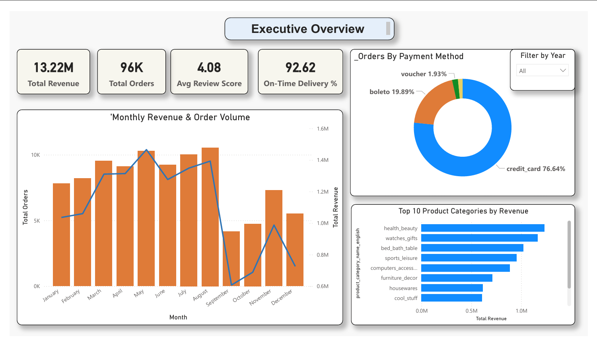
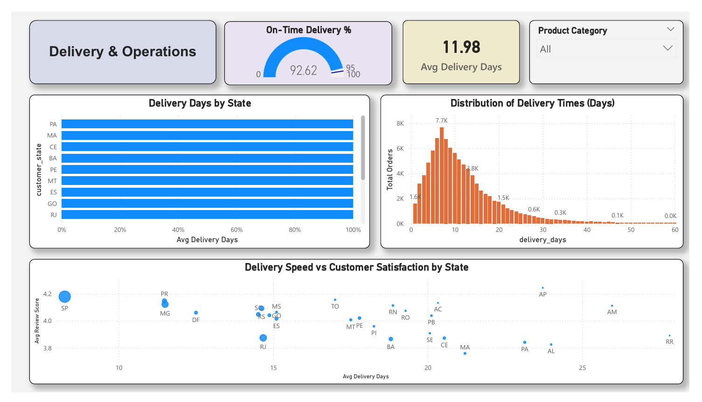
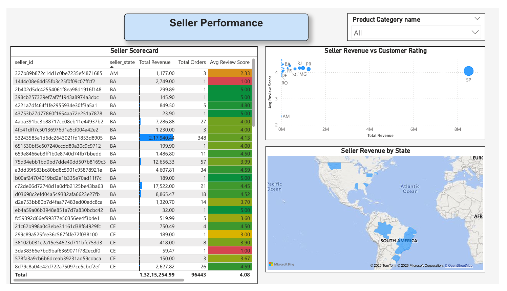

# Olist E-Commerce Analytics Dashboard

## Project Overview
Analysis of 99,441 real e-commerce orders from Olist — Brazil's largest online
marketplace — covering the period September 2016 to October 2018.
This project answers 5 key business questions using SQL, Python, and Power BI.

**Live Dashboard:** [Power BI Report Link — add after publishing]
**Tools:** MySQL | Python | Pandas | Matplotlib | Power BI
**Dataset:** Brazilian E-Commerce Public Dataset by Olist (Kaggle)


---

## Business Questions Answered
1. What is the monthly revenue trend? (Is Olist growing?)
2. Which product categories drive the most revenue?
3. How efficient is delivery? What percentage arrive on time?
4. What is the customer satisfaction score by category and state?
5. Who are the top-performing sellers?

---

## Dashboard Preview
**Page 1: Executive Overview**

**Page 2: Delivery & Operations**

**Page 3: Seller Performance**


---

## Key Insights
- Revenue grew from R$50K/month (Jan 2017) to R$1.2M/month (Nov 2017) — a 136%
increase
- Health & Beauty is the #1 revenue category (R$1.26M total)
- 91.4% of orders delivered on time across Brazil
- Average delivery time: 12.5 days (vs 23.8 days estimated)
- Credit card is the dominant payment method (74.1% of orders)
- São Paulo generates 40% of all revenue

---

## Project Structure
```
olist-analytics/
├── README.md
├── data/
│ ├── olist_master.csv # cleaned, merged master dataset
│ └── (raw CSVs not tracked) # see .gitignore
├── sql/
│ ├── 01_monthly_revenue.sql
│ ├── 02_top_categories.sql
│ ├── 03_delivery_performance.sql
│ ├── 04_customer_satisfaction.sql
│ └── 05_seller_performance.sql
├── notebooks/
│ ├── 01_data_exploration.ipynb
│ ├── 02_data_cleaning.ipynb
│ └── 03_eda_visualizations.ipynb
├── charts/
│ ├── 01_monthly_revenue.png
│ ├── 02_top_categories.png
│ ├── 03_review_scores.png
│ ├── 04_delivery_performance.png
│ ├── 05_revenue_by_state.png
│ ├── 06_payment_methods.png
│ ├── dashboard_page1.png
│ ├── dashboard_page2.png
│ └── dashboard_page3.png
└── dashboard/
 └── olist_dashboard.pbix
```
---
## How to Reproduce

### 1. Setup
```bash
git clone https://github.com/YOURUSERNAME/olist-analytics.git
cd olist-analytics
pip install -r requirements.txt
```
### 2. Download Data
Download the Olist dataset from Kaggle:
https://www.kaggle.com/datasets/olistbr/brazilian-ecommerce
Place all 9 CSV files in the data/ folder.

### 3. Load to MySQL
Create database olist_db in MySQL, then run:
```bash
python load_data.py
```
### 4. Run Notebooks
```bash
jupyter notebook
```
Run notebooks in order: 01 → 02 → 03

### 5. Open Dashboard
Open dashboard/olist_dashboard.pbix in Power BI Desktop.
Update the data source path to your local olist_master.csv.
---
## Tech Stack
| Tool | Purpose |
| ---- | ------- |
| MySQL 8.0 | Relational database, SQL analysis |
| Python 3.11 | Data cleaning, feature engineering, EDA |
| Pandas | Data manipulation |
| Matplotlib / Seaborn | Chart generation |
| SQLAlchemy | Python-to-MySQL connection |
| Power BI Desktop | Interactive dashboard |
| Git / GitHub | Version control |
---
## Author
**[Manichand Adepu]** — Data Analyst
LinkedIn: [https://www.linkedin.com/in/manichand-adepu-5585aa222/]
Email: [adepumanichand@gmail.com]
